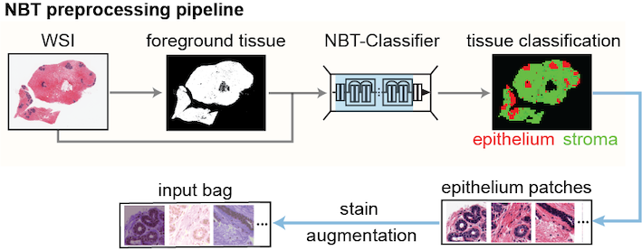

# **Multi-branch multiple-instance ordinal classification-based **_BreastAgeNet_** identified deviated tissue ageing in high-risk breast tissues**

[Paper]()

**Abstract:** Assessing breast cancer risk in high-risk populations, such as women with germline BRCA1/2 mutations (_gBRCA1/2m_), is crucial for early detection and intervention. Abnormal tissue ageing has been associated with an increased risk of breast cancer in women with benign conditions. This study introduces **_BreastAgeNet_**, a computational framework designed to predict tissue ageing statuses (<35y, 35-45y, 45-55y, and >55y) in histologically normal breast tissue (NBT) using whole slide images (WSIs). Trained on 743 WSIs from usual-risk NBT, BreastAgeNet achieved a mean absolute error (MAE) of 0.59 on an external dataset of reduction mammoplasty cases. **_BreastAgeNet_** inherently offers high interpretability through attention heatmaps generated by its multi-branch architecture, which shows strong associations with manually annotated lobule types. Additionally, unsupervised analyses of reduced features extracted by **_BreastAgeNet_** unveiled distinct age-related microscopic changes, such as  more condensed epithelial cells, increased ductal involution, and enhanced collagen deposition. When applied to high-risk _gBRCA1/2m_ carriers and breast cancer patients, **_BreastAgeNet_** revealed a greater discrepancy (MAE of 0.895 and 0.888) between chronological age and predicted tissue ageing status, indicating accelerated ageing in _gBRCA1/2m_ carriers <35 years and delayed tissue ageing in breast cancer patients >55 years. These findings highlight **_BreastAgeNet's_** ability to capture the ageing trajectory in the normal breast while identifying deviations in high-risk individuals. This framework provides novel insights into early cancer initiation and offers significant potential for advancing precision prevention strategies in _gBRCA1/2m_ carriers.


## 1. **_BreastAgeNet_** architecture

**_BreastAgeNet_** is a computational pathology (CPath) framework, incorporating a multi-branch multiple-instance learning (MIL) architecture to capture ordinal age-related histological alterations and designed to predict tissue ageing ranks in NBT from WSI. 


<p align="center">
    
</p>


## 2. Dataset Overview
The framework was developed and tested on WSIs of NBT resources from multiple cohorts, including the King's Health Partners Cancer Biobank (KHP) in London; the Netherlands Cancer Institute (NKI) in Amsterdam; the Barts Cancer Institute (BCI) in London; the École Polytechnique Fédérale de Lausanne (EPFL) in Lausanne, Switzerland; and the publicly available Susan G. Komen Tissue Bank (SGK).


<p align="center">
     
</p>


## 3. WSI pre-processing
BreastAgeNet takes a refined bag of patches from each WSI as input. For this, we pre-processed each WSI using our [_NBT-Classifier_](https://github.com/cancerbioinformatics/NBT-Classifier) framework. 

The framework performs foreground tissue detection, patch tessellation and tissue type classification, which generates a `_TC_512_patch_all.csv` file that contains the coordinates of patches and their tissue classification results for each slide.


<p align="center">
    
</p>


## 4. _BreastAgeNet_ implementation

The implementation can largely be broken down into the following four steps:
- Feature extraction
- _BreastAgeNet_ training
- _BreastAgeNet_ testing
- Visualisation

For these implementations, install BreastAgeNet under the root folder:
```
cd /path/to/project
git clone https://github.com/cancerbioinformatics/BreastAgeNet.git

cd BreastAgeNet/
conda env create -f environment.yml
conda activate breastagenet
```


## 5. BeastAgeNet Docker ([link](https://hub.docker.com/repository/docker/siyuan726/breastagenet/general))

BreastAgeNet supports Docker for the key implementation steps and for reproducing the main figures in the paper. 

To get the Docker image:
```
docker pull siyuan726/breastagenet:latest
```

or use singularity for HPC:
```
singularity pull docker://siyuan726/breastagenet:latest
```


### 5.1 Run `breastagenet` container in an interactive mode

Please prepare a local `project/` folder with a structure similar to the one shown below:
```
/path/to/project/
├── Metadata/
│   ├── train_NR.csv
│   ├── test_NR.csv
│   └── test_BRCA.csv
├── WSIs/
│   ├── SGK/slide1.svs, ...
│   ├── KHP/slide1.ndpi, ...
│   ├── NKI/slide1.mrxs, ...
│   ├── BCI/slide1.ndpi, ...
│   └── EPFL/slide1.vsi, ...
├── FEATUREs/SGK
│   ├──slide1
│   |   ├── slide1_TC_512_patch_all.csv
│   |   └── ...
│   └── ...
└── RESULTs/
```

Launch `breastagenet` container and map the local `project/` folder to the `/project` folder in the container:
```
singularity shell --nv \
--bind /path/to/project:/project \
--writable-tmpfs \
./breastagenet_latest.sif
```

Inside the container, run the following script:
```
source /opt/conda/etc/profile.d/conda.sh
conda activate breastagenet
cd /app/BreastAgeNet
```


### 5.1.1 Feature extraction

Based on the `_TC_512_patch_all.csv` file that contains the patch information, this step randomly selects target patches to form the input bag and extracts visual features for them via pre-trained feature extractors.

The script supports applying pre-trained feature extractors including pre-trained ResNet50, [UNI](https://huggingface.co/MahmoodLab/UNI), [prov-gigapath](https://huggingface.co/prov-gigapath/prov-gigapath) and [phikon](https://huggingface.co/owkin/phikon);
and stain generalisation methods including normalisation ([Reinhard](https://github.com/chia56028/Color-Transfer-between-Images)) and augmentation ([RandStainNA](https://github.com/yiqings/RandStainNA)).

The following script shows an example of extracting features from WSI files using a single GPU: 
```
CUDA_VISIBLE_DEVICES=0 python extractFeatures.py \
--model UNI \
--stain augmentation \
--root /project \
--dataset NKI \   
--image_type WSI \
--batch_size 16 \
--num_workers 8
```

for using multiple GPUs: 
```
CUDA_VISIBLE_DEVICES=0,1 torchrun --nproc-per-node=2 extractFeatures.py \
--model UNI \
--stain augmentation \
--root /project \
--dataset NKI \
--image_type WSI \
--batch_size 32 \
--num_workers 8  
```

After running all combinations of different feature extractors and stain generalisation methods, this step yields:
```
/path/to/project/
├── Metadata/
├── WSIs/
├── Features/cohort
│   ├── slide1
│   |   ├── slide1_TC_512_patch_all.csv
│   │   ├── slide1_UNI_augmentation.h5
│   │   ├── slide1_gigapath_augmentation.h5
│   │   ├── slide1_phikon_augmentation.h5
│   │   ├── slide1_ResNet50_augmentation.h5
│   │   ├── slide1_UNI_reinhard.h5
│   │   ├── slide1_gigapath_reinhard.h5
│   │   ├── slide1_phikon_reinhard.h5
│   │   └── slide1_ResNet50_reinhard.h5
│   └── ...
└── RESULTs/
```


### 5.1.2 _BreastAgeNet_ 5-fold cross-validation training 

We implemented 5-fold cross-validation training tuning factors, including feature extractors, attention mechanisms, tissue contents, and bag sizes. 

The following script shows an example of training a MultiHeadAttention-based _BreastAgeNet_ on a bag of UNI features of 250 random epithelium patches that were classified with >0.9 probability:
```
CUDA_VISIBLE_DEVICES=0 python main.py \
++task=train_cv  \
++clinic_path=/project/Metadata/train_NR_clean.csv \
++FEATURES=/project/FEATUREs  \
++resFolder=/project/Docker_test/RESULTs/main  \
++TC_epi=0.9  \
++bag_size=250  \
++model_name=UNI  \
++attention=MultiHeadAttention
```

This step yields:
```
prj_BreastAgeNet/
├── Metadata/
├── WSIs/
├── Features/
└── RESULTs/
    |── main/
    │   ├── train_cv/
    |   |    │──epi0.9_UNI_250_MultiHeadAttention_fold4_bestModel.pt
    |   |    │──epi0.9_UNI_250_MultiHeadAttention_fold4_trainvalCurves_testMAE0.53.png
    |   |    └── ...
    |   └── ...
    └── ...
```


### 5.1.3 _BreastAgeNet_ full dataset training

_BreastAgeNet_ was finally trained using the following script on the full train_NR dataset:

```
CUDA_VISIBLE_DEVICES=0 python main.py \
++task=train_full  \
++clinic_path=/project/Metadata/train_NR_clean.csv  \
++FEATURES=/project/FEATUREs  \
++resFolder=/project/Docker_test/RESULTs/main  \
++TC_epi=0.9  \
++bag_size=250  \
++model_name=UNI  \
++attention=MultiHeadAttention
```

This step yields:
```
prj_BreastAgeNet/
├── Metadata/
├── WSIs/
├── Features/
└── RESULTs/
    |── main/
    │   ├── train_full/epi0.9_UNI_250_MultiHeadAttention_full_best.pt
    |   └── ...
    └── ...
```


### 5.1.4 _BreastAgeNet_ full dataset testing

Here is an example:
```
CUDA_VISIBLE_DEVICES=0 python main.py \
++task=test_full \
++clinic_path=/project/Metadata/test_NR_clean.csv \
++FEATURES=/project/FEATUREs \
++resFolder=/project/Docker_test/RESULTs/main \
++TC_epi=0.9 \
++bag_size=250 \
++model_name=UNI \
++attention=MultiHeadAttention \
++stainFunc=reinhard \
++ckpt_pt=/app/BreastAgeNet/weights/epi0.9_UNI_250_MultiHeadAttention_full_best.pt
```


### 5.1.5 _BreastAgeNet_ a single slide testing

Here is an example in python:
```
from utils.utils_model import test_single_slide

wsi_path = "/app/example_data/WSIs/KHP_NR/19001626_FPE_3.ndpi"
age_group = 0
patch_info = "/app/example_data/FEATUREs/19001626_FPE_3/19001626_FPE_3_TC_512_patch_all.csv"
test_single_slide(wsi_path, patch_info, age_group)
```


### 5.1.6 Visualisation

We provide [notebooks](./notebooks) to reproduce the main figures in the paper. To access and run the notebooks, please run the following:

```
python -m ipykernel install \
--user \
--name=breastagenet \
--display-name="breastagenet"

chmod +x run_jupyter.sh
./run_jupyter.sh
```

Then, please follow the instructions and launch the Jupyter Lab. The notebooks are available in `/app/BreastAgeNet/notebooks`


### 5.2 Run `breastagenet` container in an non-interactive mode

### 5.2.1 feature extraction
```
singularity exec --nv \
  --bind /scratch/prj/cb_normalbreast/prj_BreastAgeNet:/project \
  ./breastagenet_latest.sif \
  bash -c "source /opt/conda/etc/profile.d/conda.sh && conda activate breastagenet && python /app/BreastAgeNet/extractFeatures.py \
    --model phikon \
    --stain augmentation \
    --root /project \
    --dataset KHP_RM \
    --image_type WSI \
    --batch_size 16 \
    --num_workers 8"
```

### 5.2.2 5-fold CV training
```
singularity exec --nv \
  --bind /scratch/prj/cb_normalbreast/prj_BreastAgeNet:/project \
  ./breastagenet_latest.sif \
  bash -c "source /opt/conda/etc/profile.d/conda.sh && conda activate breastagenet && cd /project && \
  CUDA_VISIBLE_DEVICES=0 python /app/BreastAgeNet/main.py \
  ++task=train_cv \
  ++clinic_path=/project/Metadata/train_NR_clean.csv \
  ++FEATURES=/project/FEATUREs \
  ++resFolder=/project/Docker_test/RESULTs/main \
  ++TC_epi=0.9 \
  ++bag_size=250 \
  ++model_name=UNI \
  ++attention=MultiHeadAttention"
```

### 5.2.3 full dataset training
```
singularity exec --nv \
  --bind /scratch/prj/cb_normalbreast/prj_BreastAgeNet:/project \
  ./breastagenet_latest.sif \
  bash -c "source /opt/conda/etc/profile.d/conda.sh && conda activate breastagenet && cd /project && \
    CUDA_VISIBLE_DEVICES=0 python /app/BreastAgeNet/main.py \
    ++task=train_full \
    ++clinic_path=/project/Metadata/train_NR_clean.csv \
    ++FEATURES=/project/FEATUREs \
    ++resFolder=/project/Docker_test/RESULTs/main \
    ++TC_epi=0.9 \
    ++bag_size=250 \
    ++model_name=UNI \
    ++attention=MultiHeadAttention"
```

### 5.2.4 full dataset testing
```
singularity exec --nv \
  --bind /scratch/prj/cb_normalbreast/prj_BreastAgeNet:/project \
  ./breastagenet_latest.sif \
  bash -c "source /opt/conda/etc/profile.d/conda.sh && conda activate breastagenet && cd /project && \
    CUDA_VISIBLE_DEVICES=0 python /app/BreastAgeNet/main.py \
    ++task=test_full \
    ++clinic_path=/project/Metadata/test_NR_clean.csv \
    ++FEATURES=/project/FEATUREs \
    ++resFolder=/project/Docker_test/RESULTs/main \
    ++TC_epi=0.9 \
    ++bag_size=250 \
    ++model_name=UNI \
    ++attention=MultiHeadAttention \
    ++stainFunc=reinhard \
    ++ckpt_pt=/app/BreastAgeNet/weights/epi0.9_UNI_250_MultiHeadAttention_full_best.pt"
```

### 5.2.5 Jupyter notebook visualisation
```
singularity exec --nv \
./breastagenet_latest.sif \
bash -c 'source /opt/conda/etc/profile.d/conda.sh && \
conda activate breastagenet && \
cd /app/BreastAgeNet && \
python -m ipykernel install --user --name=breastagenet --display-name="breastagenet" && \
bash run_jupyter.sh'
```


## 6. _BreastAgeNet_ future directions
_BreastAgeNet_ can identify NBT with an abnormal ageing process. Taking it further, attention heatmaps can pinpoint tissue regions responsible for 'mismatched' tissue ageing predictions. This approach opens the door to techniques like spatial transcriptomics, which could further elucidate molecular abnormalities at these sites—potentially identifying early indicators of cancer initiation.


## Acknowledgements

