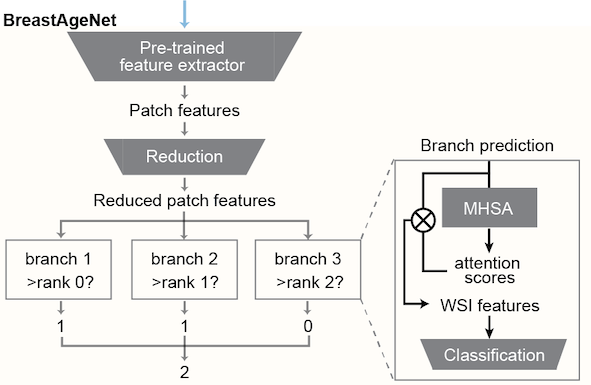

# **Multi-branch multiple-instance ordinal classification-based **_BreastAgeNet_** identified deviated tissue ageing in high-risk breast tissues**

[Paper]() | [Cite]()

**Abstract:** Assessing breast cancer risk in high-risk populations, such as women with germline BRCA1/2 mutations (_gBRCA1/2m_), is crucial for early detection and intervention. Abnormal tissue ageing has been associated with an increased risk of breast cancer in women with benign conditions. This study introduces **_BreastAgeNet_**, a computational framework designed to predict tissue ageing statuses (<35y, 35-45y, 45-55y, and >55y) in histologically normal breast tissue (NBT) using whole slide images (WSIs). Trained on 743 WSIs from usual-risk NBT, BreastAgeNet achieved a mean absolute error (MAE) of 0.59 on an external dataset of reduction mammoplasty cases. **_BreastAgeNet_** inherently offers high interpretability through attention heatmaps generated by its multi-branch architecture, which shows strong associations with manually annotated lobule types. Additionally, unsupervised analyses of reduced features extracted by **_BreastAgeNet_** unveiled distinct age-related microscopic changes, such as  more condensed epithelial cells, increased ductal involution, and enhanced collagen deposition. When applied to high-risk _gBRCA1/2m_ carriers and breast cancer patients, **_BreastAgeNet_** revealed a greater discrepancy (MAE of 0.895 and 0.888) between chronological age and predicted tissue ageing status, indicating accelerated ageing in _gBRCA1/2m_ carriers <35 years and delayed tissue ageing in breast cancer patients >55 years. These findings highlight **_BreastAgeNet's_** ability to capture the ageing trajectory in the normal breast while identifying deviations in high-risk individuals. This framework provides novel insights into early cancer initiation and offers significant potential for advancing precision prevention strategies in _gBRCA1/2m_ carriers.


## **_BreastAgeNet_** architecture

**_BreastAgeNet_** is a computational pathology (CPath) framework, incorporating a multi-branch multiple-instance learning (MIL) architecture to capture ordinal age-related histological alterations and designed to predict tissue ageing ranks in NBT from WSI. 

<p align="center">
    
</p>


## Dataset Overview
The framework was developed and tested on WSIs of NBT resources from multiple cohorts, including the King's Health Partners Cancer Biobank (KHP) in London; the Netherlands Cancer Institute (NKI) in Amsterdam; the Barts Cancer Institute (BCI) in London; the École Polytechnique Fédérale de Lausanne (EPFL) in Lausanne, Switzerland; and the publicly available Susan G. Komen Tissue Bank (SGK).

<p align="center">
     
</p>


## WSI pre-processing

<p align="center">
    
</p>


BreastAgeNet takes refined bag of patches from each WSI as input. For this, we pre-processed each WSI using our [_NBT-Classifier_](https://github.com/cancerbioinformatics/NBT-Classifier) framework. 

The framework performs foreground tissue detection, patch tessellation and tissue type classification, which generates a `_patch_wsi.csv` file that contains the coordinates of patches and their tissue classification results for each slide.


## BreastAgeNet implementation

To get started, install BreastAgeNet under the root folder:
```
cd prj_BreastAgeNet
git clone https://github.com/cancerbioinformatics/BreastAgeNet.git

cd prj_BreastAgeNet/
conda env create -f environment.yml
conda activate breastagenet
```

The data is organised as follows:
```
prj_BreastAgeNet/
├── BreastAgeNet/
├── Metadata/
│   ├── train_NR.csv
│   ├── test_NR.csv
│   └── test_BRCA.csv
├── WSIs/
│   ├── SGK/slide1.svs, ...
│   ├── KHP/slide1.ndpi, ...
│   ├── NKI/slide1.mrxs, ...
│   ├── BCI/slide1.ndpi, ...
│   └── EPFL/slide1.vsi, ...
├── FEATUREs/SGK
│   ├──slide1
│   |   ├── slide1_TC_512_patch_wsi.csv
│   |   └── ...
│   └── ...
└── RESULTs/
    |── main/
    │   ├── train_cv/
    │   ├── train_full/
    │   └── test_full/
    |── figures/
    └── ...
```


The implementation can largely be broken down into the following four steps:

**Step 1.1**: Feature extraction

Based on the `_patch_wsi.csv` file, this step extracts visual features for each WSI via pre-trained feature extractors.

For this step, implement the following code:
```
python extractFeatures.py --model UNI --stain augmentation --cohort NKI
```

The script supports applying models including pre-trained ResNet50, [UNI](https://huggingface.co/MahmoodLab/UNI), [prov-gigapath](https://huggingface.co/prov-gigapath/prov-gigapath) and [phikon](https://huggingface.co/owkin/phikon) and stain generalisation methods such as normalisation ([Reinhard](https://github.com/chia56028/Color-Transfer-between-Images)) and augmentation ([RandStainNA](https://github.com/yiqings/RandStainNA)).

After running all combinations of different feature extractor and stain generalisation methods, this step yields:
```
prj_BreastAgeNet/
├── Metadata/
├── WSIs/
├── Features/cohort
│   ├── slide1
│   |   ├── slide1_TC_512_patch_wsi.csv
│   │   ├── slide1_UNI_augmentation.h5
│   │   ├── slide1_gigapath_augmentation.h5
│   │   ├── slide1_phikon_augmentation.h5
│   │   ├── slide1_ResNet50_augmentation.h5
│   │   ├── slide1_UNI_reinhard.h5
│   │   ├── slide1_gigapath_reinhard.h5
│   │   ├── slide1_phikon_reinhard.h5
│   │   └── slide1_ResNet50_reinhard.h5
│   └── ...
└── RESULTs/
```


**Step 1.2**: clean data
This step further cleans the data by removing invalid slides that either failed to obtain features or contain epithelium patches (with a confidence higher than 0.9) less than 5. For detailed implementation, please refer to [notebook clean_data](notebooks/clean_data.ipynb).


### Step 2. _BreastAgeNet_ training 

Step 2.1: Five-fold cross-validation (cv) training

The training was implemented using different configurations through 5-fold cross-validation, tuning factors including feature extractor, attention mechanism, tissue content, and bag size. 

For the cv training, implement the following code:
```
python main.py --config_name config_v3
```

This step yields:
```
prj_BreastAgeNet/
├── Metadata/
├── WSIs/
├── Features/
└── RESULTs/
    |── main/
    │   ├── train_cv/
    |   |    │──epi0.9_UNI_250_MultiHeadAttention_fold4_bestModel.pt
    |   |    │──epi0.9_UNI_250_MultiHeadAttention_fold4_trainvalCurves_testMAE0.53.png
    |   |    └── ...
    |   └── ...
    └── ...
```

After identifying the best configuration, run the following code for a training on the full train_NR dataset:
```
python main.py --config_name config_v3
```
This step yields:
```
prj_BreastAgeNet/
├── Metadata/
├── WSIs/
├── Features/
└── RESULTs/
    |── main/
    │   ├── train_cv/
    │   ├── train_full/
    └── ...
```


### Step 3. Visualisation
Step 2.1 tSNE projection of the whole dataset
**_BreastAgeNet_**  learns ageing-related microscopic patterns in a data-driven manner, using a multi-head self-attention mechanism to prioritize relevant patterns for accurate branch predictions. By integrating information from multiple branches, the model enhances the robustness of its predictions and provides deeper insights into the nuanced ageing-related changes in NBT. Please refer to [notebook vis_tSNE](notebooks/vis_tSNE.ipynb).

Step 2.2 Attention heatmap for a single WSI
Moreover, **_BreastAgeNet_** provides attention heatmaps that can directly visualise ageing-related spatial heterogeneity across the tissue, with this variability showing strong associations with manually annotated, age-related lobule types. Please refer to [notebook vis_attention_heatmap](notebooks/vis_attention_heatmap.ipynb)


### Step 4. External testing
In the context of ordinal classification, where errors between adjacent classes are considered less severe than those between more distant classes, **_BreastAgeNet_** demonstrated robust performance on WSIs of NBT derived from reduction mammoplasties, with only 9% severe misclassification. With its substantiated ability to model ageing trajectories in NBT, <i>BreastAgeNet</i> has revealed deviations between expected (chronological) and observed (predicted) tissue ageing in high-risk NBT from _gBRCA1/2_ mutation carriers or breast cancer patients. For this, please implement the following:

```
import json
from utils_model import *

with open("./configs/config_v1.json", "r") as f:
    config = json.load(f)

model = load_BreastAgeNet(config)
repeats = inference(model, clinic_file, n_iteration=10, stainFunc="reinhard", config=config)
output_df = get_averaged_outputs(repeats)
output_df
```


## Docker
**_BreastAgeNet_** offers Docker to reproduce the main figures from the paper and infer tissue ageing ranks for custom datasets.


## **_BreastAgeNet_** future directions
**_BreastAgeNet_** can identify NBT with abnormal ageing process. Taking it further, attention heatmaps can pinpoint tissue regions responsible for 'mismatched' tissue ageing predictions. This approach opens the door to techniques like spatial transcriptomics, which could further elucidate molecular abnormalities at these sites—potentially identifying early indicators of cancer initiation.


## Acknowledgements

